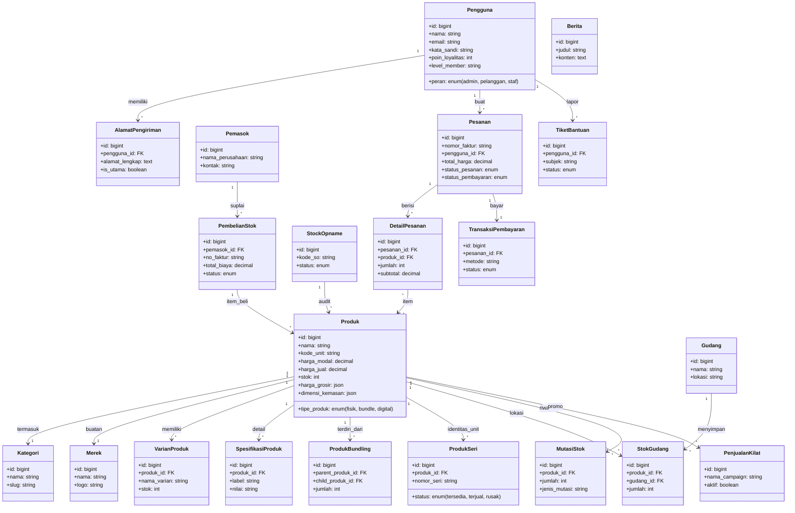
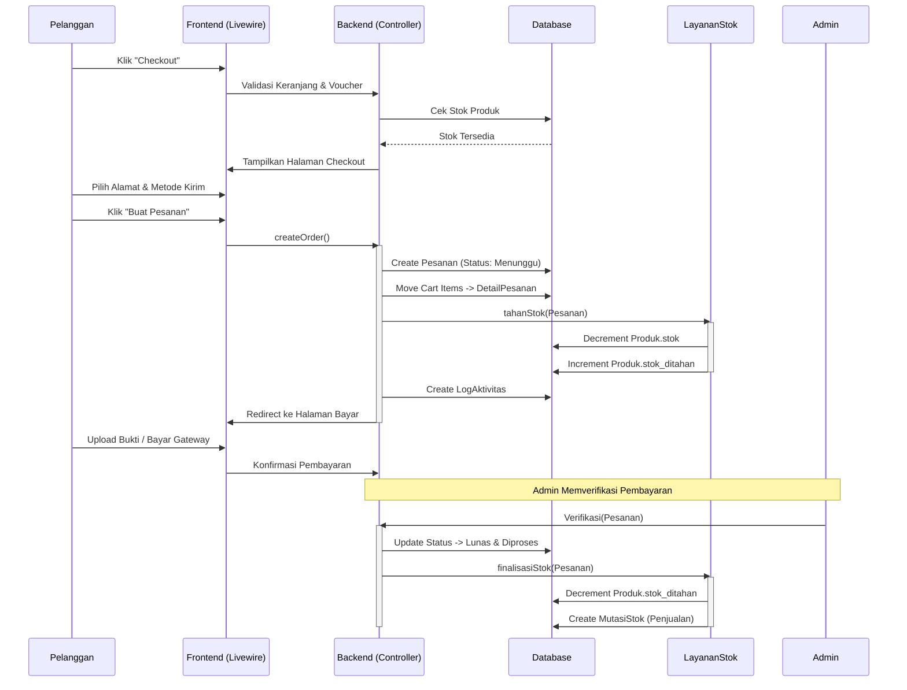
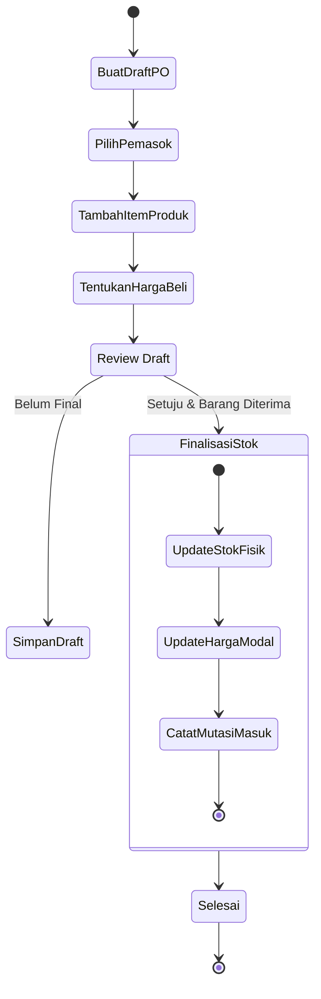

# UML Diagram - Teqara Enterprise Hub v16.0

Dokumen ini berisi representasi visual arsitektur sistem Teqara menggunakan diagram UML (Unified Modeling Language).

## 1. Class Diagram (Struktur Database & Relasi Model)

Diagram ini menggambarkan struktur tabel database dan hubungan antar entitas dalam sistem.



## 2. Use Case Diagram (Interaksi Aktor)

Menggambarkan fitur apa saja yang dapat diakses oleh Admin dan Pelanggan.

```mermaid
usecaseDiagram
    actor "Pelanggan" as User
    actor "Administrator" as Admin

    package "Storefront (Toko)" {
        usecase "Jelajah Katalog" as UC1
        usecase "Cari Produk (Spotlight)" as UC2
        usecase "Kelola Keranjang" as UC3
        usecase "Checkout & Bayar" as UC4
        usecase "Lacak Pesanan" as UC5
        usecase "Ajukan Bantuan" as UC6
    }

    package "Admin Dashboard" {
        usecase "Kelola Produk (CRUD)" as UC7
        usecase "Audit Stok (SO & Mutasi)" as UC8
        usecase "Manajemen Pesanan" as UC9
        usecase "Verifikasi Pembayaran" as UC10
        usecase "Pembelian Stok (PO)" as UC11
        usecase "Laporan Analitik" as UC12
        usecase "Setup Promo & Flash Sale" as UC13
    }

    User --> UC1
    User --> UC2
    User --> UC3
    User --> UC4
    User --> UC5
    User --> UC6

    Admin --> UC7
    Admin --> UC8
    Admin --> UC9
    Admin --> UC10
    Admin --> UC11
    Admin --> UC12
    Admin --> UC13
```

## 3. Sequence Diagram (Alur Checkout Enterprise)

Detail langkah-langkah teknis saat pelanggan melakukan pembelian hingga stok berkurang.



## 4. Activity Diagram (Siklus Pengadaan Barang - Procurement)

Alur kerja Admin dalam menambah stok melalui pembelian ke pemasok.



## 5. Entity Relationship Diagram (ERD) - Ringkas

Relasi kunci antar tabel utama dalam sistem Teqara.

*   **Produk** `1` --- `*` **VarianProduk**
*   **Produk** `1` --- `*` **GambarProduk**
*   **Produk** `*` --- `*` **Pesanan** (via DetailPesanan)
*   **Pengguna** `1` --- `*` **Pesanan**
*   **Pesanan** `1` --- `1` **TransaksiPembayaran**
*   **Pemasok** `1` --- `*` **PembelianStok**
*   **PembelianStok** `*` --- `*` **Produk** (via DetailPembelian)
*   **Gudang** `1` --- `*` **StokGudang**
*   **Produk** `*` --- `*` **PenjualanKilat** (via ProdukPenjualanKilat)

---
*Dokumen ini dibuat otomatis oleh Asisten AI Teqara pada 6 Februari 2026.*
